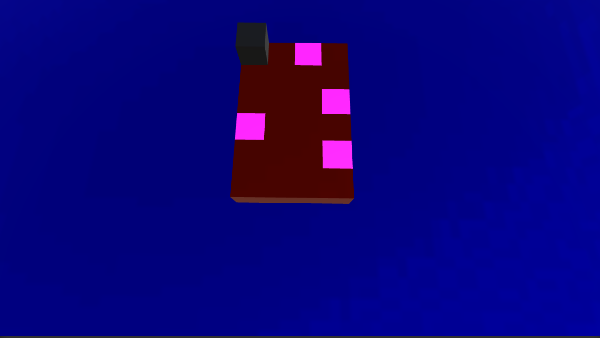
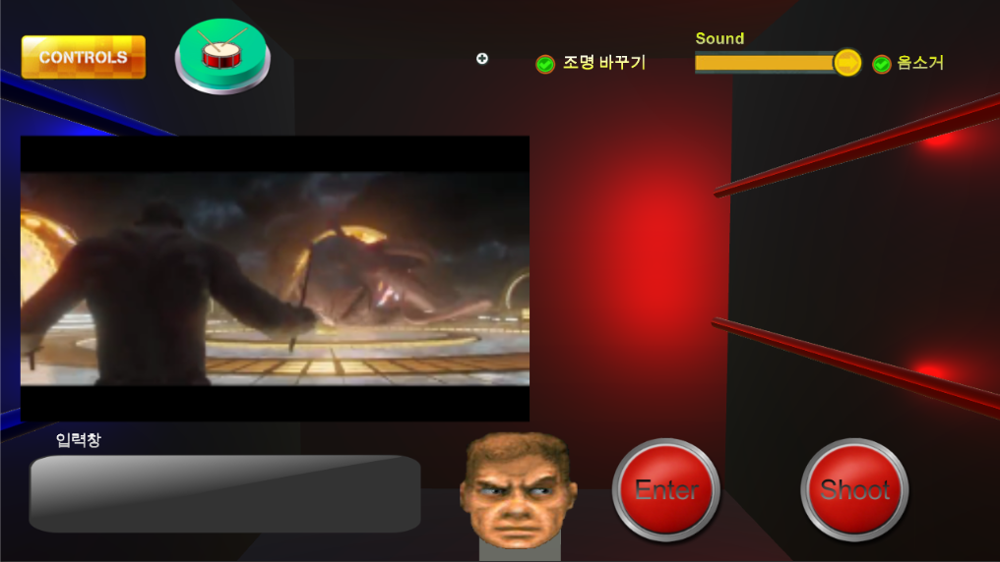
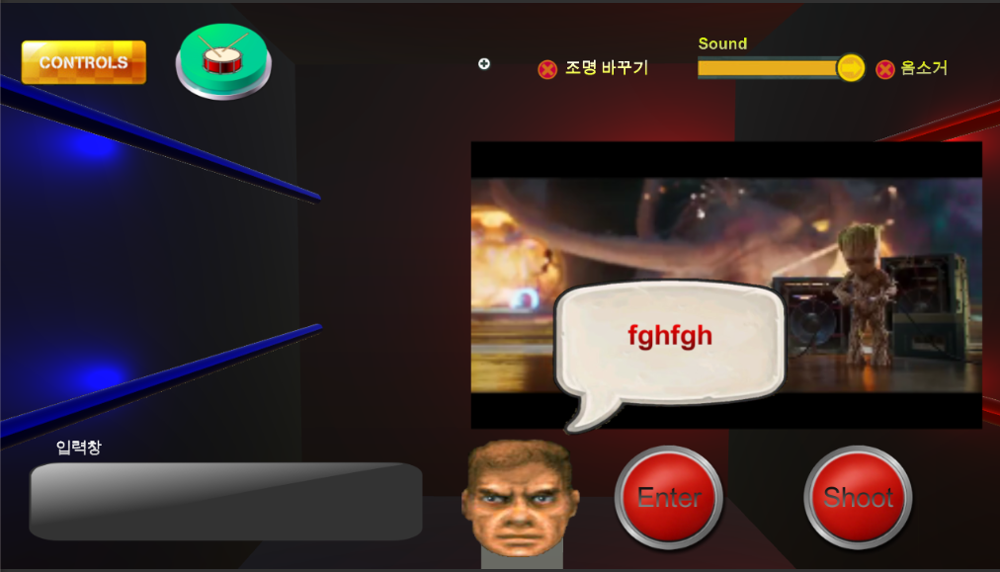
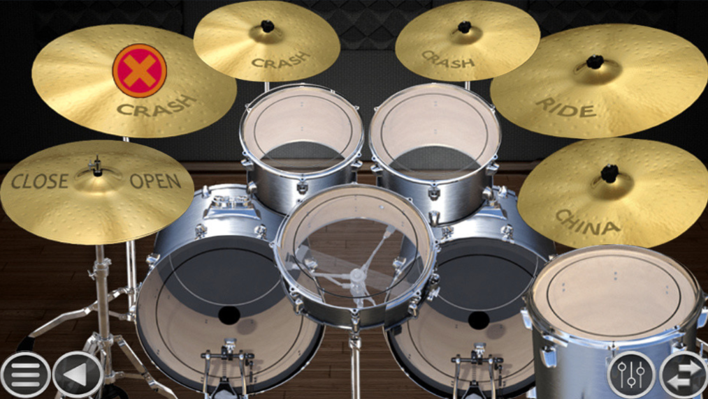
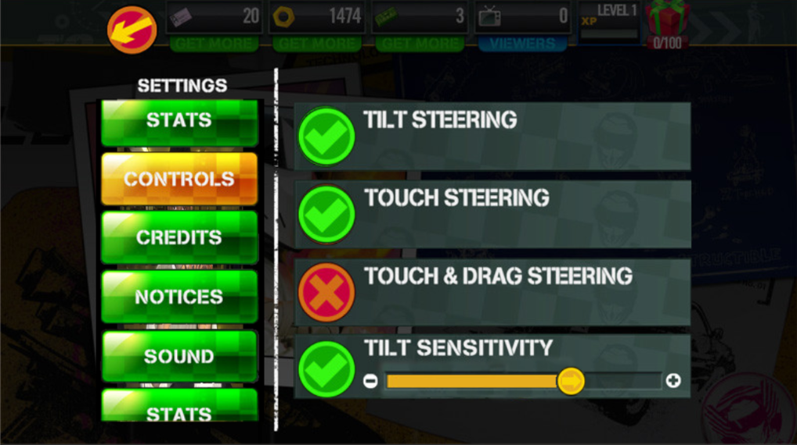

+ 제목 : NGUI를 이용한 모바일 드럼 게임, NGUI, Raycast, video player 연습
+ 개발 기간 : 20190422 ~ 20190429
+ 설명 : 모바일 드럼 게임, Unity sprite atlas 연습, NGUI, Toggle, button, scroll view, video player, raycast 등 사용

+ NGUI는 유료이므로 Asset에 포함시키지 않음

