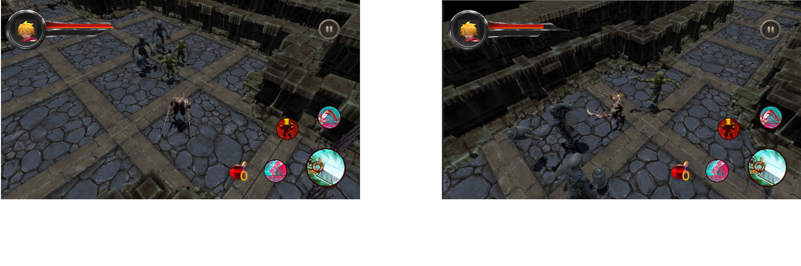

+ 제목: Kool MORPG
+ 유니티 버전 : 2019.1.9f1
+ 개발 기간 : 20190823 ~ 20190927
+ 설명 : 레이븐과 비슷한 형테의 게임을 만들어 보려고 함.
+ 실제 플레이어 하는 in game부분을 제외한 모든 부분을 맡아서 함.
+ (script에서는 In Game BattleScene폴더: 백종규 담당. 이외 : 장현명 담당)
+ 추가 컨텐츠 업데이트 - 달빛조각사처럼 만들어보기, 몬스터헌터처럼 만들어보기
+ [동영상](https://www.youtube.com/watch?v=97Is86wai30)
+ [게임 설명](https://drive.google.com/open?id=1wWEQF_Xh8-CU0tCtg3R7pjgMeD4wdOKJ)
+ [기술 설명](https://sagacityjang.tistory.com/54)
+ [지도 클릭 시 클릭된 위치로 캐릭터 이동 설명](https://sagacityjang.tistory.com/53)

