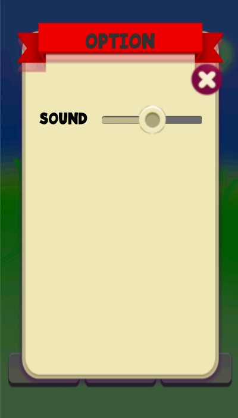
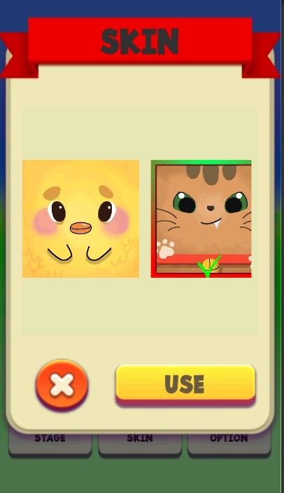
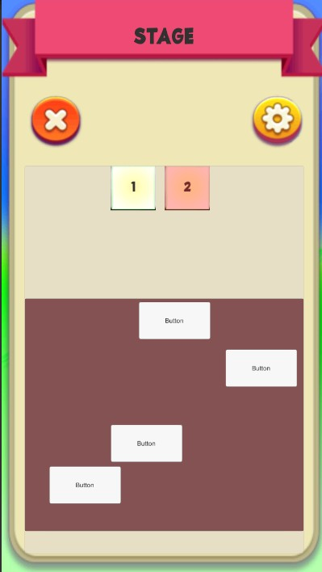
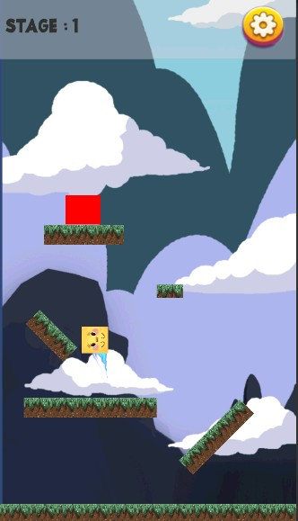
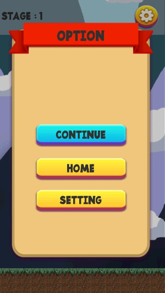
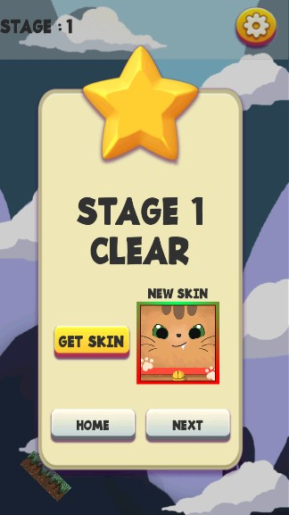
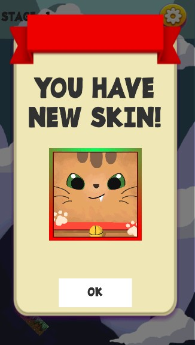
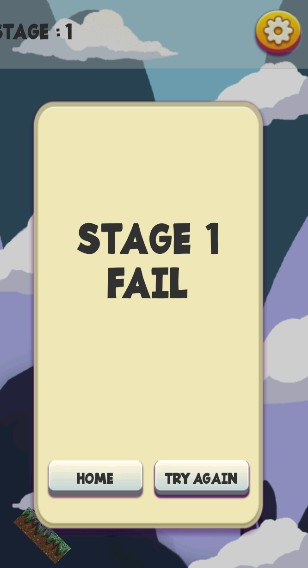

+ 제목 : go up
+ 유니티 버전 : 2019.1.9f1
+ 개발 기간 : 20191230 ~
+ 설명 : 손까락으로 스크린을 드래그하면 드래그 한 만큼의 거리에 따라 점프하는 힘이 조절된다. 이를 이용하여 목적지까지 가는 게임이다. 2D이며 많은 집중력와 감각을 요구한다. 하다가 열받을 수 있음.
+ 디자인귗낳고 힘들다 그냥 아무 디자인 없는 하이퍼캐쥬얼로 가야겠다.

+ 6일만에 완성. 문제는 디자인
+ 동영상은 추우에 올림.

+ 실행화면

