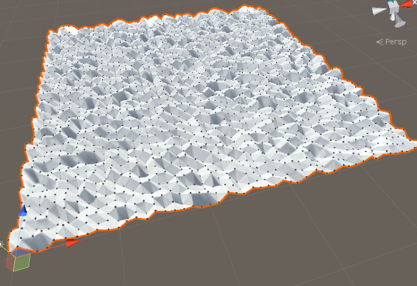

+제목 : Terrain 직접 구현(실험)
+ 유니티 버전 : 2019.1.9f1
+ 개발 기간: 20191230 ~ 
+ 설명 : 터레인을 직접 구현한다.
+ [실험 설명 링크](https://sagacityjang.tistory.com/59)

+ 터레인을 구현 후 터레인을 클릭하면 클릭한 위치 주변 y축이 올라가게 바꾸려고 한다. 
+ Box Mesh를 구현하였고 Box Collider를 구현
+ Sphere Collider를 구현하는중

